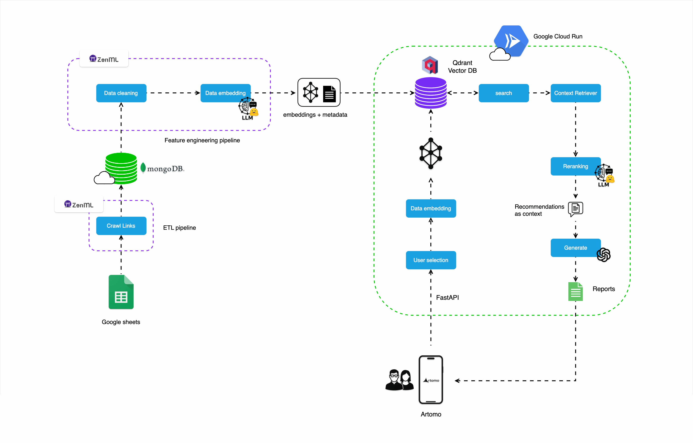
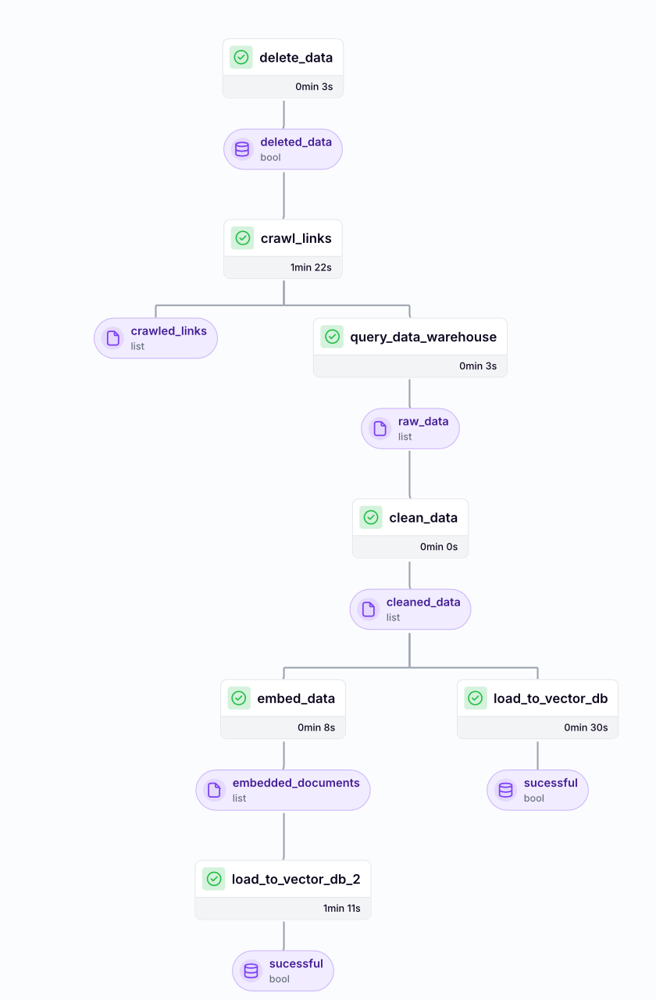
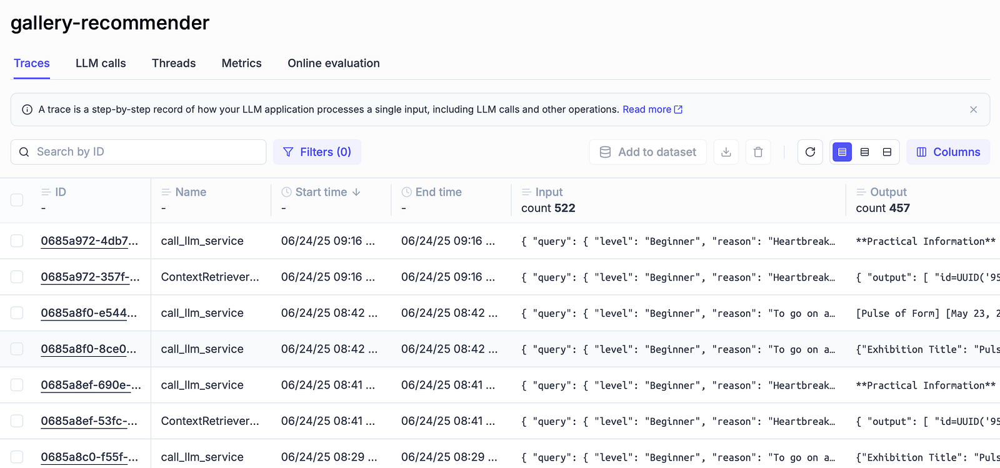

# Art Gallery Recommender 🎨
An AI-powered gallery recommendation system that curates art exhibitions based on user preferences, mood, time, and location.

> **Note:** This is a demonstration version of a production ML system. Some configurations and business logic have been simplified for public sharing.

---

## 📸 Watch the walkthrough
[](https://youtube.com/shorts/ZFtNlTuYH44?feature=share)

---

## 📚 Table of Contents
- [Features](#-features)
- [Architecture](#-architecture)
- [Screenshots](#-screenshots)
- [Tech Stack](#-tech-stack)
- [Local Dependencies](#-local-dependencies)
- [Cloud Services](#-cloud-services)
- [Project Structure](#-project-structure)
- [Installation](#-installation)

---

## ✨ Features
- 🎯 **Personalized Recommendations** — Curated art exhibitions using Retrieval-Augmented Generation (RAG) + gpt-4o model.
- 📍 **Smart Filters** — Suggests galleries based on location, exhibition dates, your current mood, reason to visit and your available time.
- 🗺️ **Map Integration** — Easily navigate to galleries with in-app Apple Maps integration.
- ⚡ **Low Latency Backend** — Powered by Google Cloud Run and Qdrant vector search to bring the best free art exhinitions for you within seconds!
- 🗂️ **Cached Reports** — Avoids regenerating LLM output for faster performance.

---

## 🏗 Architecture
This system demonstrates a modern ML architecture with:
- **RAG Pipeline**: Retrieval-Augmented Generation for personalized recommendations
- **Vector Search**: Qdrant for semantic similarity matching
- **Microservices**: FastAPI with async processing
- **ML Ops**: ZenML pipelines for ETL and feature engineering
- **Monitoring**: Opik integration for LLM observability



---

## 📖 Key Features Demonstrated

**RAG Pipeline Architecture**
- Semantic search with Qdrant vector database
- LLM-powered recommendation generation
- Context-aware prompt engineering

**ML Operations**
- Automated ETL pipelines with ZenML
- Feature engineering for recommendation systems  
- Model monitoring and experiment tracking

**Microservices Design**
- FastAPI with async request handling
- Modular domain-driven architecture
- Cloud-native deployment patterns

---

## 🛠 Tech Stack
| Layer        | Technology |
|--------------|------------|
| **Frontend** | SwiftUI (iOS) |
| **Backend**  | FastAPI, Google Cloud Run |
| **Database** | MongoDB, Qdrant |
| **AI Models**| OpenAI GPT,  vector search |
| **Infra**    | ZenML, Docker |
| **Monitor**  | CometML, Opik |

---

## Local Dependencies

| Component        | Version (min) | Notes                               |
|------------------|---------------|-------------------------------------|
| Python           | 3.11.x        | Use pyenv to manage versions        |
| Poetry           | 1.7+          | Dependency + virtualenv management  |
| Docker           | 24+           | Optional for local container runs   |
| Qdrant (local)   | 1.9+          | Run via Docker for vector store     |
| MongoDB (local)  | 6.0+          | If you use Mongo; else remove       |
| ZenML (local)    | 0.74.0        | More information on installation and usage here: https://docs.zenml.io |
---

## Cloud Services

| Service              | Provider  | Purpose                                   |
|----------------------|-----------|-------------------------------------------|
| Cloud Run            | GCP       | Host FastAPI inference service            |
| Cloud Tasks          | GCP       | Async job dispatch for per-exhibition gen |
| Firestore (Native)   | GCP       | Cache for exhibition reports              |
| Secret Manager       | GCP       | API keys & config                         |
| Artifact Registry    | GCP       | Container images                          |
| Qdrant (Managed/VM)  | Qdrant/GCP| Vector search (exhibitions)               |
| OpenAI API           | OpenAI    | LLM report generation                     |
| Comet/Opik (optional)| Comet/Opik| Experiment/run tracking                   |

---

## 🗂️ Project Structure

This project follows **Domain-Driven Design** and **Clean Architecture** principles:

```bash
.
├── configs/                    # Pipeline configurations and settings
├── gallery_recommender/        # Core application package
│   ├── application/           # Application services and use cases
│   │   ├── crawlers/         # Data extraction services
│   │   ├── preprocessing/    # Data transformation pipeline
│   │   ├── rag/             # Retrieval-Augmented Generation logic
│   │   └── networks/        # ML model integrations
│   ├── domain/               # Business logic and entities
│   │   ├── base/            # Base classes for data persistence
│   │   └── *.py             # Domain models and types
│   ├── infrastructure/       # External service integrations
│   │   ├── db/              # Database connectors (MongoDB, Qdrant)
│   │   ├── gcp/             # Cloud platform integrations  
│   │   └── *.py             # API and monitoring services
│   └── model/               # ML inference implementations
├── pipelines/               # ZenML pipeline definitions
├── steps/                   # ZenML pipeline components
├── tools/                   # CLI utilities and service entry points
└── DEMO_NOTICE.md          # Important information about this demo version
```

### Architecture Highlights

- **Domain Layer**: Pure business logic, framework-independent
- **Application Layer**: Use cases and application services  
- **Infrastructure Layer**: External integrations and persistence
- **Clean Dependencies**: Dependency inversion principle maintained

## ZenML Monitoring

This project uses ZenML to trigger and monitor the ETL and feature engineering pipelines

---

## Opik (Comet.ml) Monitoring

This project also utilizes a monitoring platform called Opik (by Comet.ML) to monitor the prompts and also LLM outputs


## 🚀 Installation

> **⚠️ Important:** This is a demonstration repository showcasing ML system architecture. Production configurations, API keys, and proprietary business logic have been abstracted for public sharing.

### Prerequisites
```bash
# Install dependencies using Poetry
poetry install

# Set up environment variables
cp .env.example .env
# Edit .env with your configuration
```

### Local Development
```bash
# Start local infrastructure
poetry run poe local-infrastructure-up

# Run the ML service
poetry run poe run-inference-ml-service

# Run data processing pipeline
poetry run poe run-digital-data-etl-demo
```

### Docker Setup
```bash
# Start with Docker Compose
docker-compose up -d
```

## ⚙️ Configuration

Copy `.env.example` to `.env` and configure:

```bash
# OpenAI API (required for LLM features)
OPENAI_API_KEY=your_openai_key

# Database (MongoDB for metadata, Qdrant for vectors)
DATABASE_HOST=localhost
QDRANT_DATABASE_HOST=localhost

# Optional: Monitoring
COMET_API_KEY=your_comet_key
```

## 🧪 Demo Mode

The system includes mock data and simplified configurations for demonstration:

```bash
# Run with demo data
poetry run poe run-demo-pipeline

# Test recommendation endpoint
poetry run poe call-rag-retrieval-module
```

## 🏗️ Technical Architecture

### RAG (Retrieval-Augmented Generation) Pipeline
1. **Document Embedding**: Art exhibition data vectorized using sentence transformers
2. **Semantic Search**: Qdrant vector database for similarity matching
3. **Context Retrieval**: Relevant exhibitions retrieved based on user query
4. **LLM Generation**: OpenAI GPT models generate personalized recommendations
5. **Response Formatting**: Structured output with exhibition details and reasoning

### ML Operations Pipeline
- **Data Ingestion**: Automated crawling and data extraction
- **Feature Engineering**: Text preprocessing and embedding generation
- **Model Deployment**: FastAPI services with async processing
- **Monitoring**: Opik integration for LLM observability
- **Orchestration**: ZenML for reproducible ML workflows

## 🚨 Important Notice

**Please read [DEMO_NOTICE.md](./DEMO_NOTICE.md) for important information about this demonstration version.**

This repository showcases technical architecture and implementation patterns. Production-specific business logic, data sources, and configurations have been abstracted for public sharing.

## 📋 Requirements

- Python 3.11+
- Poetry for dependency management  
- Docker (optional, for local services)
- OpenAI API key (for LLM functionality)
- MongoDB and Qdrant (local or cloud)

## 🤝 Contributing

This is a demonstration repository. For educational purposes, feel free to:
- Study the architecture and implementation patterns
- Use as reference for similar ML systems
- Adapt components for your own projects

## 📄 License

MIT License - See LICENSE file for details.
